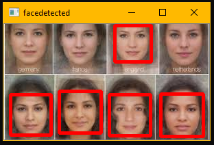

# Face_Detection_OpenCV

In this project we will detect the no. of faces present in an image.

## Installation:
* cv2 -> OpenCV

## Files Description:
* **Face_Detection.py** it a python file that conatins the code for detecting faces in an image.
* **haarcascade_frontalface_default.xml** it is a frontal face datector.
* **8.jpg** image contains several faces in it.
* **Face_Detection_OpenCV.zip** it is a zip file which contains above 3 files.

## Result:
Finally we are able to detect the no. of faces in the image. 
Total No. of faces are - 6  

